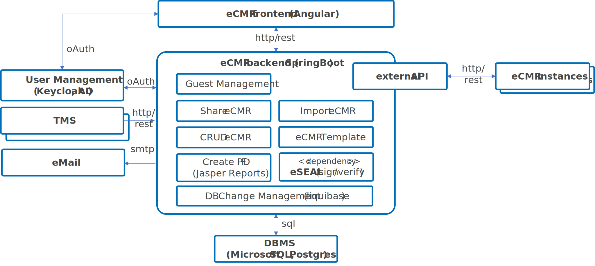

[[section-building-block-view]]
== Building Block View

=== eCMR Architecture and Components

.eCMR Component Overview

This image shows the major components and which internal system (left side)
are connected to the ecmr. The ecmr backend is handling all the connections
and providing an external api for share ecmr with other ecmr instances or
systems that use the ecmr api and data model.

==== User Management (OAuth)
The current ecmr version is tested with keycloak as user
management, but any other user management can be used as long OAuth is provided.

==== Database Management Systems (SQL)
The current ecmr version is tested with postgres and Microsoft SQL Server.
Other SQL-based DBMS can be connected. However, it must be ensured that their SQL dialect or native SQL implementation does not deviate from the standard.

==== Core Frameworks
* The *eCMR Backend* is based on Java SpringBoot
* The *eCMR Frontend* is based on Angular
* All components are designed and implemented for use in *application
containers* Docker-compatible environments can also be used for execution.
The setup is tested on Podman and OKD Kubernetes (also uses Podman).
Execution without the use of application containers is still possible, but requires special softness when setting the port and environment variables.
